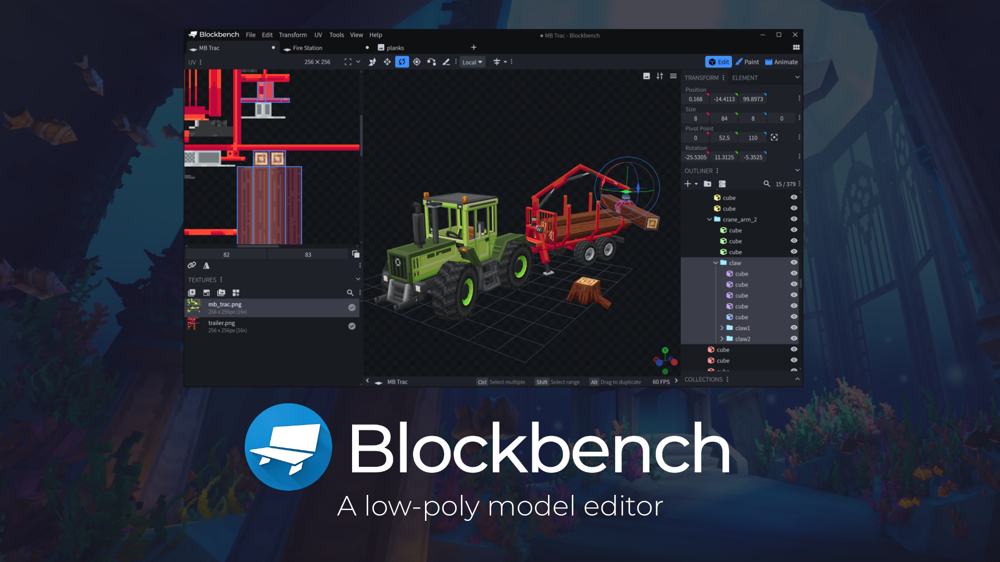
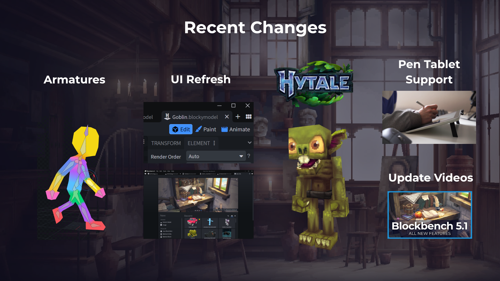
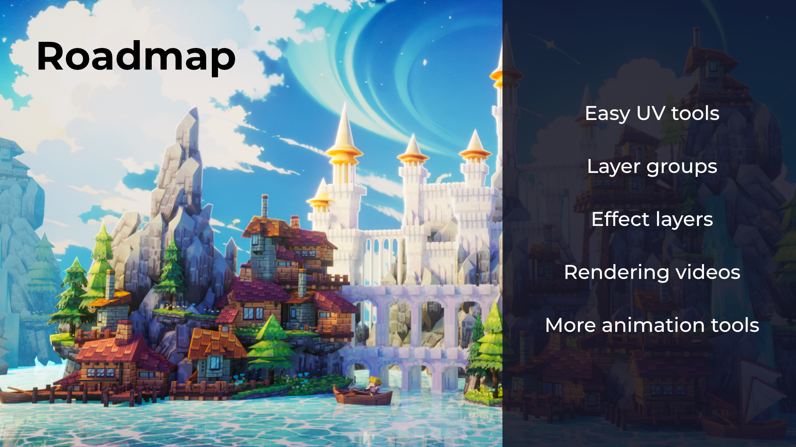

<!-- 
└── project name folder/
    ├── project.md
    │   ├── # Name
    │   ├── Description of Project
    │   ├── ### Further Links
    │   ├── ## Slide 0 - title slide
    │   │   └── Slide 0 speaker notes
    │   ├── ## Slide 1 - Changelog
    │   │   └── Slide 1 speaker notes
    │   ├── ## Slide 2 - Roadmap/Future
    │   │   └── Slide 2 speaker notes
    │   └── ## Presence at LGM
    ├── Slide 0.png
    ├── Slide 1.jpg
    ├── Slide 2.png
    └── logo.svg 
ignore copying above, just a reminder on how we'd like you to structure the submission.
-->

# Sample Project

Blockbench is an open source 3D modeling program focused on making low-poly modeling easy and accessible for everyone.

### Further Links:
https://blockbench.net

### Notes
The slides themselves were not made in Blockbench (there is no text tool yet), but all models in the background art was modeled in Blockbench by the community.

## Slide 0 - Overview

Blockbench offers a beginner friendly alternative to more traditional 3D software, but still has advanced features for professional artists.

* The modeling tools are easy to understand and optimized for stylized low-poly models.
* Features paint tools with a strong focus on pixel art, including standard image editing tools like different brushes, layers, and selection tools.
* There is also an animation editor with keyframe and math expression support, graph editor, and a simple IK feature.
* Blockbench has a built-in plugin browser. Plugins can be installed to add features and integrate Blockbench into more specialized workflows.
* Partnership with Mojang Studios, who use Blockbench as their primary tool to make models and animations for Minecraft.
* Strong community in indie game-dev and modding for games like Minecraft.

## Slide 1 - Recent Changes

* Added armatures and mesh deformation
* Started to port the codebase to Typescript and modernize it
* Gave the UI a fresh look
* Partnered with the team behind the game Hytale, to make Blockbench both their internal tool to create models for the game, and to make it the official modeling tool for the modding community.
* Added more image formats and improved support for pen tablets
* Started to produce update videos to showcase everything new with each update to the users

## Slide 2 - Roadmap

There are a bunch of cool things planned for the next updates, including:

* New UV tools to make UV mapping super easy
* Improvements to layers in the image editor, including layer groups and effect layers
* Tools to render images and videos in Blockbench: Cameras, rendering, post processing
* Tools to make more complex animations
