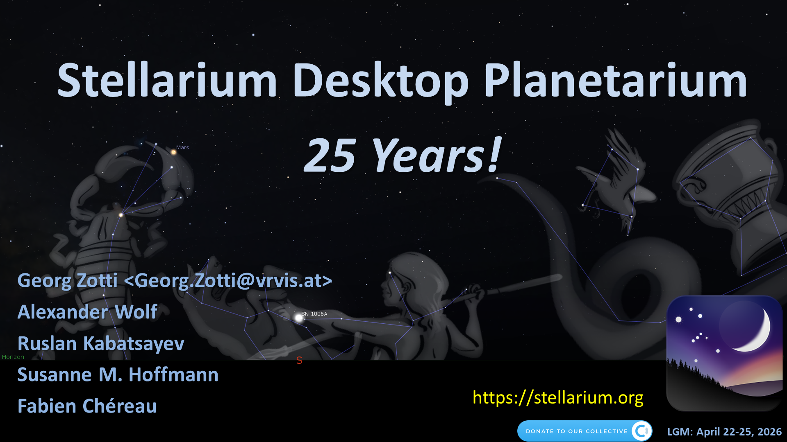
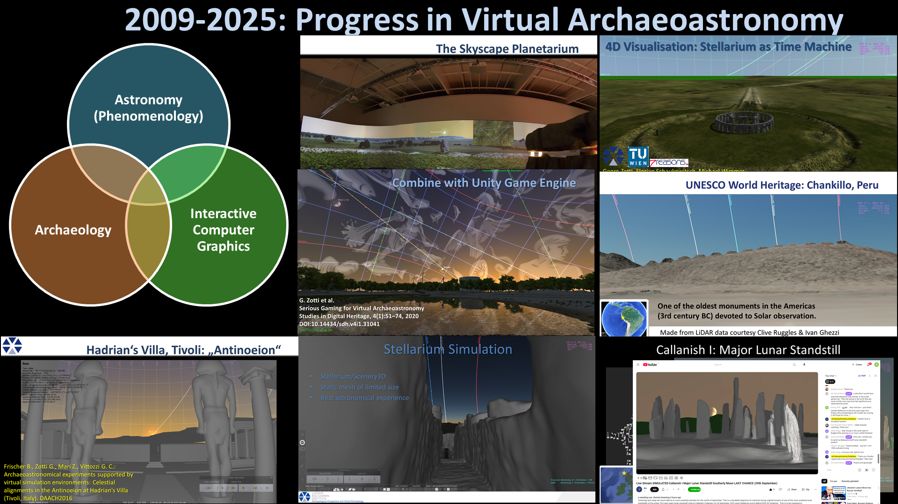
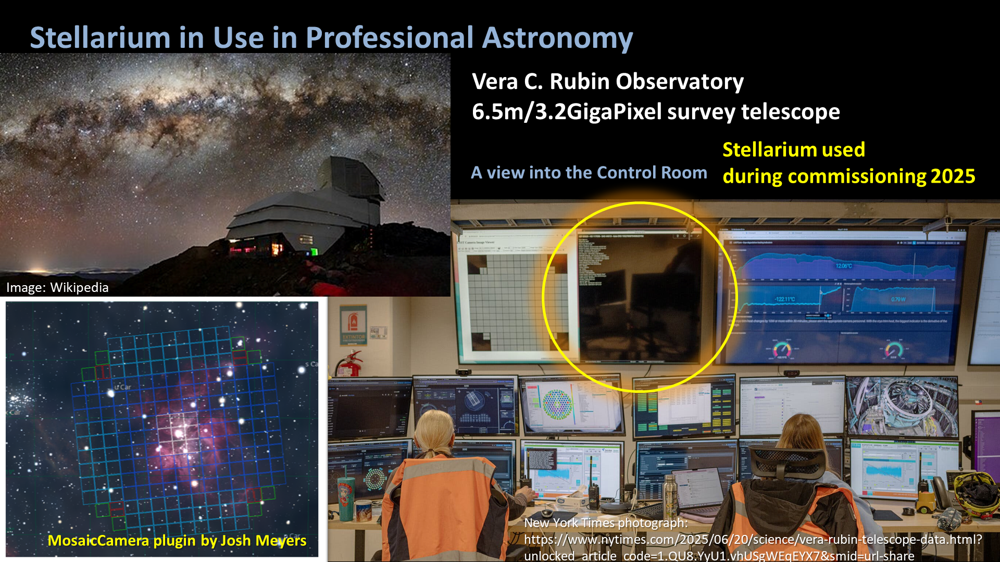
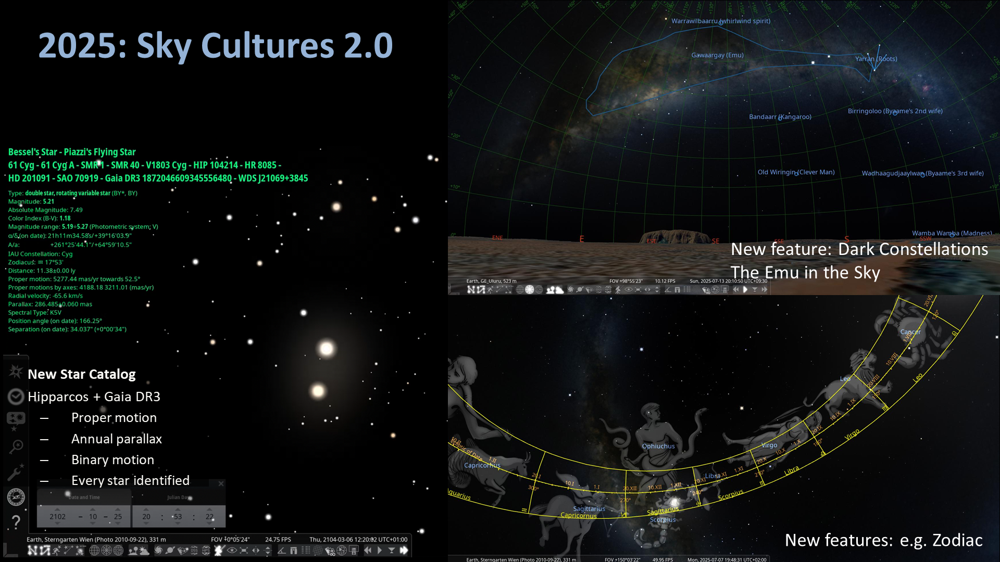
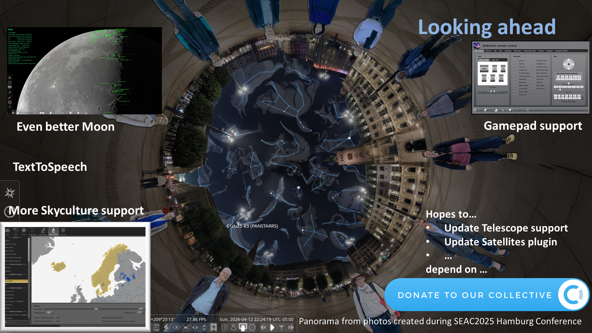

<!-- 
└── project name folder/
    ├── project.md
    │   ├── # Name
    │   ├── Description of Project
    │   ├── ### Further Links
    │   ├── ## Slide 0 - title slide
    │   │   └── Slide 0 speaker notes
    │   ├── ## Slide 1 - Changelog
    │   │   └── Slide 1 speaker notes
    │   ├── ## Slide 2 - Roadmap/Future
    │   │   └── Slide 2 speaker notes
    │   └── ## Presence at LGM
    ├── Slide 0.png
    ├── Slide 1.jpg
    ├── Slide 2.png
    └── logo.svg 
ignore copying above, just a reminder on how we'd like you to structure the submission.
-->

# Stellarium

Stellarium is a free open source planetarium for your computer. 
It shows a realistic sky in 3D, just like what you see with the naked eye, binoculars or a telescope.

### Further Links:
https://stellarium.org/

## Slide 0 - title slide

The Stellarium desktop planetarium celebrated 25 years since its inception in summer of 2000. 
Its founder Fabien Chéreau meanwhile has created Stellarium-web and Stellarium-mobile for iOS and Android, 
and other main developers have taken over: 
- Alexander Wolf, Maintainer
- Georg Zotti, Co-maintainer, astronomer, focus on Cultural Astronomy (Virtual Archaeoastronomy)
- Ruslan Kabatsayev, Co-maintainer, new atmosphere model, Lunar surface, shader expert
- Susanne M. Hoffmann, Sky Culture Researcher

## Slide 1 - History

<!-- Virtual Archaeoastronomy thumbnails 2009-25 -->
Stellarium has become the leading application for cultural astronomy research and outreach and is used by millions of amateur and professional astronomers on Windows, Linux and MacOS.

## Slide 2 - Scientific Highlight 2025

<!-- Vera C. Rubin commissioning 2025 -->
Stellarium was used in commissioning the **Simonyi Survey Telescope** at the **Vera C. Rubin observatory**, one of the most advanced professional astronomical telescopes. 
Josh Meyers developed a plugin to show the image mosaic of its super wide field 3.2 Gigapixel camera and of others. He donated the plugin to all Stellarium users. 

## Slide 3 - Changelog

<!-- Exotic sky cultures -->
Recent activities
- V25.1: new star catalog: finally accurate proper motions, distances, parallax effects, orbiting binary stars. (Thanks to contributor Henry Leung)
- V25.1: Skycultures 2.0 introduced. Improved file format and features for constellations, figures, stories of cultures worldwide.
- V25.2: The International Astronomical Union's Working Group for Star Names (IAU WGSN headed by our Susanne M. Hoffmann) utilizes Stellarium for disseminating new names.
- V25.3: Sky Culture Maker plugin simplifies creation of skycultures
- V25.4: Narration: Text-to-Speech output
- V26.1: First official version for the Windows for Arm64 platform

- 2025-07: Tutorial session at ISAAC/IAU Symposium 399 cultural astronomy conference in Melbourne (G. Zotti)
- 2025-08: Tutorial session on horizon panoramas at SEAC cultural astronomy conference in Hamburg (G. Zotti)
- More presentations and invited talks at various international conferences (G. Zotti, cultural astronomy)

V25.1, 25.2, 25.3, 25.4: **1.1 Million direct downloads** (not counting installation via Linux package managers)

## Slide 4 - Roadmap

<!-- Map interface, Lunar closeup -->

2026 will see consolidation: 
- Skycultures 2.0: Active map feature to show where skycultures are distributed on the globe (Moritz Rätz)
- Web-based interface improvements, also with Gamepad support (Kutaibaa Akraa)
- Even better lunar surface (Ruslan)
- Text to Speech refinement (Georg)
- Telescope Guiding: Extend support to ASCOM Alpaca family of instruments? 
- Satellites plugin must be modernized due to data format change

- Find funding  (research project)?

## Presence at LGM
Developers are distributed worldwide. Sorry, no personal attendance.
