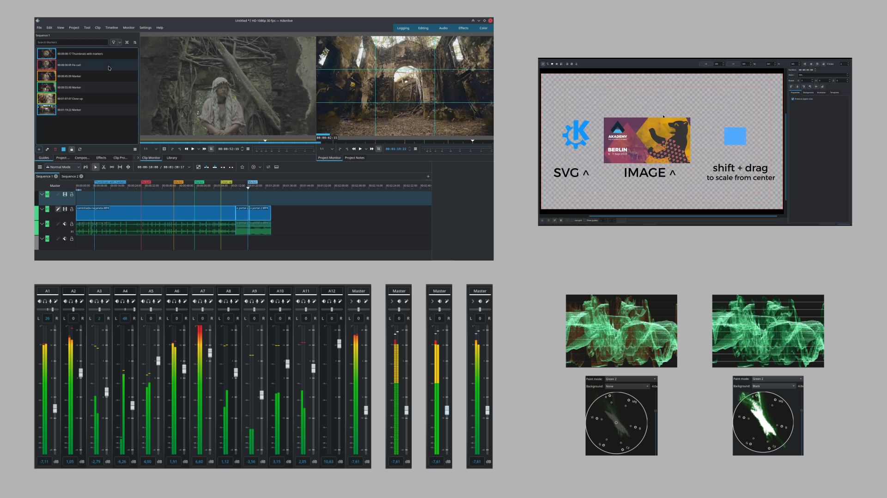
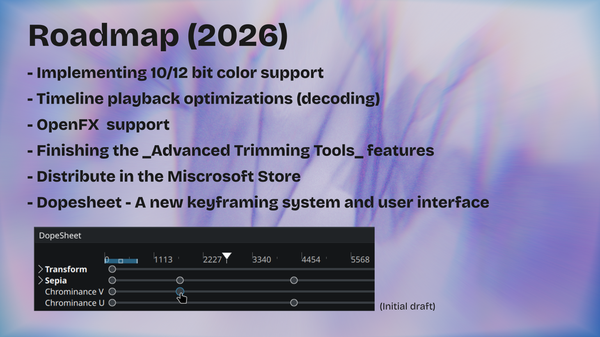

## Slide 0

Kdenlive is a powerful video editor made by the KDE community. 

### Further links

- Website: <https://kdenlive.org>
- Dicussion: <https://discuss.kde.org/tag/kdenlive>
- Code: <https://invent.kde.org/multimedia/kdenlive>
- Chat: <https://matrix.to/#/#kdenlive:kde.org>

---

## Slide 1 - Release 1 

 

Speakers Notes:
The 25.04 release added a powerful automatic Object Segmentation tool for background removal. We also refactored the audiowaveform generation giving a 300% performance boost as well as refactored the sampling method to display more accurate and higher resolution waveforms. This release also improved support for OpenTimelineIO by rewriting the import and export functions to use the C++ library. 

---

## Slide 2 - Release 2

Speakers Notes:  
The 25.08 release focused heavily on stabilization, bringing over 300 commits and fixing more than 15 crashes. Instead of major new features, the effort went into polishing and bug fixing. We redesigned the audio mixer, improved scopes, improved the Titler and gave a major overhaul to Guides and Markers tool.

---

## Slide 3 - Release 3

Speakers Notes:  
The 25.12 release focused on improving the user experience and polishing the user interface. We added a Welcome Screen and a new docking system and also revamped the Audiowaveform view in the Clip Monitor with an added minimap. 

---

## Slide 4 - Release 4

Speakers Notes:  
......
26.04 is the first major release of 2026 bringing monitor mirroring, animated transition previews, change the speed of multiple clips at once, and ability to import a clip directly from the timeline context menu.

---

## Slide 5 - Roadmap

Speakers Notes:  
The roadmap is constantly being reviewed and updated, and some of the upcoming highlights in 2026 include:

- Implementing 10/12 bit color support
- Timeline playback optimizations (decoding)
- OpenFX  support
- Dopesheet - A new keyframing system and user interface
- Finishing the _Advanced Trimming Tools_ features
- Distribute in the Miscrosoft Store

---
